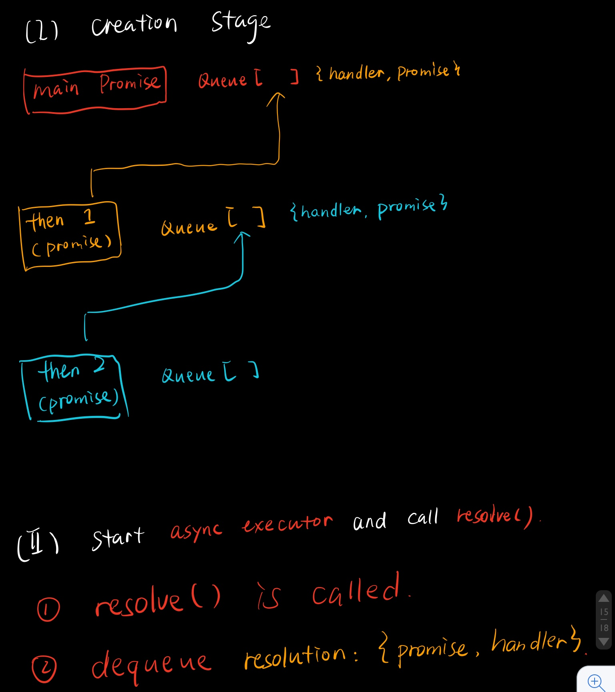
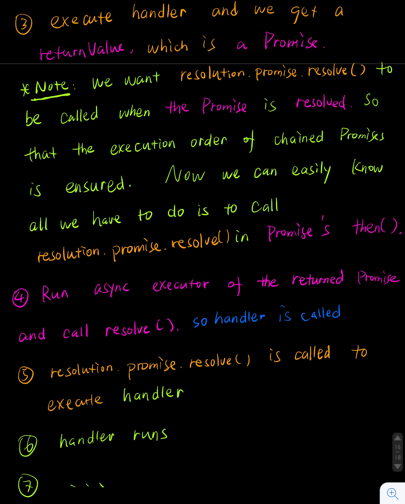
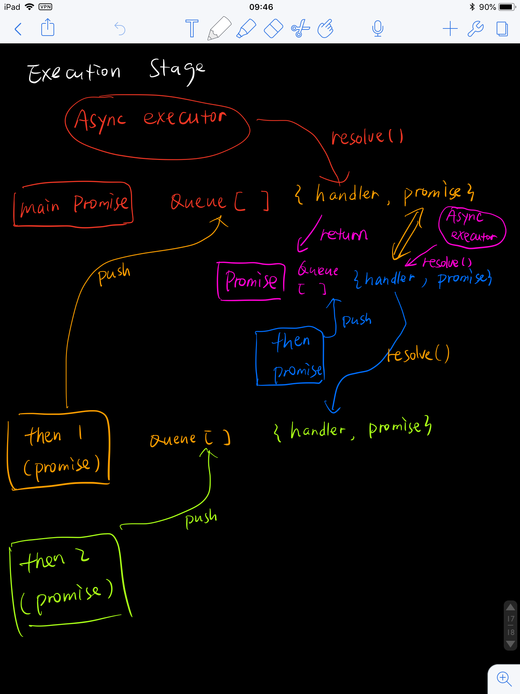

### ES6的Promise实现
Implement promise in es6 case by case.    
实现一个class: MyPromise(简写MP)

### case 1: executor function is called immediately.
```js
// test case

new MyPromise(function () {
    string = 'foo';
});
```
说明: executor需要立即执行.   

解决: 在生成MP时, 让他接受一个executor, 然后立刻执行就好.
```js
// solution

class MyPromise {
  constructor(executor) {
    executor();
  }
}
```


### case 2: resolution handler is called when promise is resolved.
```js
// test case

var promise = new MyPromise(function (resolve) {
    setTimeout(function () {
        resolve(testString);
    }, 100);
});

promise.then(function (string) {
    t.equal(string, testString);
    t.end();
});
```
说明: 当executor resolve(可以理解为异步有了结果, 可以开始"解决(resolve)", 即调用resolve方法)时, resolution handler需要被调用. (then中的函数称resolution handler, 即用来对结果进行"解决(resolve)").   

解决:
+ 添加then方法, 接收resolutionHandler, 保存到resolutionQueue当中.
+ 添加resolve方法, 接收"结果", 被调用时对"结果"执行resolutionHandler.
+ 为executor提供resolve方法. executor在适当时机得到"结果"并"解决"// resolve(value).

```js
// solution

class MyPromise {
  constructor(executor) {
    this._resolutionQueue = [];

    executor(this.resolve.bind(this));
  }

  resolve(value) {
    while(this._resolutionQueue.length > 0) {
      const handler = this._resolutionQueue.shift();
      handler(value);
    }
  }

  then(resolutionHandler) {
    this._resolutionQueue.push(resolutionHandler);
  }
}
```

### case 3: promise supports many resolution handlers.
```js
// test case
var testString = 'foo';

var promise = new MyPromise(function (resolve) {
    setTimeout(function () {
        resolve(testString);
    }, 100);
});

promise.then(function (string) {
    t.equal(string, testString);
});

promise.then(function (string) {
    t.equal(string, testString);
    t.end();
});
```
说明: promise支持多个resolution handler.   

解决: 为了支持多个resolution handler, 所以在case 2中就先采用了一个queue来保存, 以支持多个then中的resolution handler.所以这里case 3在case 2中就已经实现了.


### case 4: resolution handlers can be chained.
```js
// test case

var testString = 'foo';

var promise = new MyPromise(function (resolve) {
    setTimeout(function () {
        resolve();
    }, 100);
});

promise.then(function () {

    return new MyPromise(function (resolve) {
        setTimeout(function () {
            resolve(testString);
        }, 100);
    });

}).then(function (string) {
    t.equal(string, testString);
    t.end();
});
```
说明: MP需要支持多个resolution handler被chain起来, 所以继续改造来支持then被链式调用.   
在test case中, 期望的流程是   
1. promise的executor执行setTimeout
2. 在100ms后调用了promise的"解决", 即resolve(), 然后开始执行第一个then中的"解决"
3. 这里第一个then中返回了一个新的promise, 执行这个新promise的executor
4. 新promise有了"结果"testString, 调用resolve, 去第二个then中"解决"testString
5. 执行第二个then.
   
解决: 为了满足期望的顺序, 应该
1. then需要返回一个promise类型, 用来支持链式调用then. 所以这里在then中new一个新的MP并返回.
2. 
  + 在执行resolve中的resolution handler时, 对其返回值进行检查
    - 如果```[当前then]```中的resolution handler被resolve后, 又```[返回了一个promise]```, 那么就需要把```[下一个then]```当中的resolution handler, 通过这个```[返回的promise]```来调用 (这里保证了按顺序chain). 
    - 也就是说, 把```[下一个then]```中的resolution handler放在```[返回promise]```的then之中(等返回promise有了结果再执行"后续handler").
    - 而这时的"后续handler", 正是之前push到queue中的东西.
    - 所以总结来说, ```[返回promise]的then中```应该[拿到"结果"]并把用"后续handler"自己的resolve去"解决"这个"结果"(每个handler和自己的resolve是一一对应的).





```js
// solution

class MyPromise {
  constructor(executor) {
    this._resolutionQueue = [];

    executor(this.resolve.bind(this));
  }

  resolve(value) {
    while(this._resolutionQueue.length > 0) {
      const resolution = this._resolutionQueue.shift();
      const returnValue = resolution.handler(value);

      if (returnValue && returnValue instanceof MyPromise) {
        returnValue.then(v => {
          resolution.promise.resolve(v);
        });
      }

    }
  }

  then(resolutionHandler) {
    const newPromise = new MyPromise(() => {});

    this._resolutionQueue.push({
      handler: resolutionHandler,
      promise: newPromise
    });

    return newPromise;
  }
}
```

### case 5: chaining works with non-promise return values.
```js
// test case

var testString = 'foo';

var promise = new MyPromise(function (resolve) {
    setTimeout(function () {
        resolve();
    }, 100);
});

promise.then(function () {

    return testString;

}).then(function (string) {
    t.equal(string, testString);
    t.end();
});
```

说明: 在case 4中我们只解决了handler返回一个promise类型时可以chain的效果, 但是如果返回了一个非promise的值, 我们并没有调用resolve去衔接promise. promise chain就这样断开了.   
   
解决: 在resolve的if后添加一个else, 用来处理返回值不是MP类型的"结果"


### case 6: resolution handlers can be attached when promise is resolved.
```js
// test case

var testString = 'foo';

var promise = new MyPromise(function (resolve) {
    setTimeout(function () {
        resolve(testString);
    }, 100);
});

promise.then(function () {
    setTimeout(function () {
        promise.then(function (value) {
            t.equal(value, testString);
            t.end();
        });
    }, 100);
});
```

说明: 要让resolution handler在promise被resolve之后仍然可以通过then添加并执行. 之前的情况都是async executor完成后就自动调用了resolve来"解决", 在resolve了之后attach的then, 仅仅是push进了queue而不会被执行.   

解决: 引入状态, 对于没resolve之前pending态下的then, 只需push进queue就好. 而resolved态下的then, 需要立刻run对应的handler. 状态的变化从pending => resolved发生在resolve被调用. 这时除了改变state, 还需要保存传入resolve的value(用被resolved态下的then执行时使用), 所以为MP引入一个value属性来保存resolve后的值(即"结果"). 让之后的then还能继续"解决"这个"结果".

```js
// solution

class MyPromise {
  constructor(executor) {
    this._state = 'pending';
    this._value;

    this._resolutionQueue = [];

    executor(this.resolve.bind(this));
  }

  _runResolutionHandlers() {
    while(this._resolutionQueue.length > 0) {
      const resolution = this._resolutionQueue.shift();
      const returnValue = resolution.handler(this._value);

      if (returnValue && returnValue instanceof MyPromise) {
        returnValue.then(v => {
          resolution.promise.resolve(v);
        });
      } else {
        // 这里
        resolution.promise.resolve(returnValue);
      }
    }
  }

  resolve(value) {
    this._state = 'resolved';
    this._value = value;

    this._runResolutionHandlers();
  }

  then(resolutionHandler) {
    const newPromise = new MyPromise(() => {});

    this._resolutionQueue.push({
      handler: resolutionHandler,
      promise: newPromise
    });

    if (this._state === 'resolved') {
      this._runResolutionHandlers();
    }

    return newPromise;
  }
}
```

### case 7: calling resolve second time has no effect.
```js
// test case

var testString = 'foo';
var testString2 = 'bar';

var promise = new MyPromise(function (resolve) {
    setTimeout(function () {
        resolve(testString);
        resolve(testString2);
    }, 100);
});

promise.then(function (value) {
    t.equal(value, testString);

    setTimeout(function () {
        promise.then(function (value) {
            t.equal(value, testString);
            t.end();
        });
    }, 100);
});
```

说明: 在handler中调用第二次resolve方法不要产生影响. (只有第一次resolve是有效的)   

解决: 在第一次resolve之后我们会改变pending => resolved, 所以在resolve()中只要检查状态就好. 如果已经resolved了, skip之后的method.

```js
// Solution

class MyPromise {
  constructor(executor) {
    this._state = 'pending';
    this._value;

    this._resolutionQueue = [];

    executor(this.resolve.bind(this));
  }

  _runResolutionHandlers() {
    while(this._resolutionQueue.length > 0) {
      const resolution = this._resolutionQueue.shift();
      const returnValue = resolution.handler(this._value);

      if (returnValue && returnValue instanceof MyPromise) {
        returnValue.then(v => {
          resolution.promise.resolve(v);
        });
      } else {
        resolution.promise.resolve(returnValue);
      }
    }
  }

  resolve(value) {
    // 这里
    if (this._state === 'pending') {
      this._state = 'resolved';
      this._value = value;

      this._runResolutionHandlers();
    }
  }

  then(resolutionHandler) {
    const newPromise = new MyPromise(() => {});

    this._resolutionQueue.push({
      handler: resolutionHandler,
      promise: newPromise
    });

    if (this._state === 'resolved') {
      this._runResolutionHandlers();
    }

    return newPromise;
  }
}
```

### case 8: rejection handler is called when promise is rejected.
```js
// test case 

var testError = new Error('Something went wrong');

var promise = new MyPromise(function (resolve, reject) {
    setTimeout(function () {
        reject(testError);
    }, 100);
});

promise.catch(function (value) {
    t.equal(value, testError);
    t.end();
});
```

说明: 与resolve("解决")相对应, 新增一种reject("拒绝"). 基本上(reject, rejectionHandler)和(resolve, resolutionHander)几乎是一样的.   

解决: 在async executor执行完成后, 调用```reject```来执行```catch```方法注册的```rejectionHandler```(类似调用resolve来执行then注册的resolutionHandler). 这个case只用copy and paste就好

```js
class MyPromise {
  constructor(executor) {
    this._state = 'pending';

    this._value;
    this._rejectionReason;

    this._resolutionQueue = [];
    this._rejectionQueue = [];

    executor(this.resolve.bind(this), this.reject.bind(this));
  }

  // resolution
  _runResolutionHandlers() {
    while(this._resolutionQueue.length > 0) {
      const resolution = this._resolutionQueue.shift();
      const returnValue = resolution.handler(this._value);

      if (returnValue && returnValue instanceof MyPromise) {
        returnValue.then(v => {
          resolution.promise.resolve(v);
        });
      } else {
        resolution.promise.resolve(returnValue);
      }
    }
  }

  resolve(value) {
    if (this._state === 'pending') {
      this._state = 'resolved';
      this._value = value;

      this._runResolutionHandlers();
    }
  }

  then(resolutionHandler) {
    const newPromise = new MyPromise(() => {});

    this._resolutionQueue.push({
      handler: resolutionHandler,
      promise: newPromise
    });

    if (this._state === 'resolved') {
      this._runResolutionHandlers();
    }

    return newPromise;
  }

  // rejection
  _runRejectionHandlers() {
    while(this._rejectionQueue.length > 0) {
      const rejection = this._rejectionQueue.shift();
      // 👇下面这行实现了执行rejectionHandler
      const returnValue = rejection.handler(this._rejectionReason);
      
      // 👇这里暂时没有因为"对称性"把resolve改动成reject, 仍然是调用的是resolve.
      // (其实对于这个test case而言, 下面的代码没有影响, 可以先暂时不用考虑, 其实resolve本身的含义是可以衔接then.)
      if (returnValue && returnValue instanceof MyPromise) {
        returnValue.then(v => {
          rejection.promise.resolve(v);
        });
      } else {
        rejection.promise.resolve(returnValue);
      }
    }
  }

  reject(reason) {
    if (this._state === 'pending') {
      this._state = 'rejected';
      this._rejectionReason = reason;

      this._runRejectionHandlers();
    }
  }

  catch(rejectionHandler) {
    const newPromise = new MyPromise(() => {});

    this._rejectionQueue.push({
      handler: rejectionHandler,
      promise: newPromise
    });

    if (this._state === 'rejected') {
      this._runRejectionHandlers();
    }

    return newPromise;
  }
}
```

case 9: chaining works with rejection handlers. (Better description: rejections are passed downstream)
```js
// test case

var testError = new Error('Something went wrong');

var promise = new MyPromise(function (resolve, reject) {
    setTimeout(function () {
        reject(testError);
    }, 100);
});

promise.then(function () {
    return new MyPromise(function (resolve) {
        setTimeout(function () {
            resolve(testError);
        }, 100);
    });
}).catch(function (value) {
    t.equal(value, testError);
    t.end();
});
```
说明: 参考test case, 当main promise 被reject后, skip掉中间所有的resolution handlers, 而直接被最后面的catch()捕获到rejectionReason并执行rejection handlers.   

解决:
+ 在之前的实现里, 调用reject后, 仅仅是去rejectionQueue里执行rejectionHandler. (而这个case 9和case 8不同, 当promise与catch中间有了then, 其实这个时候第一个reject执行时, main Promise里的rejectionQueue里什么都没有, 因为catch是注册到它邻接的前一个promise的queue上的)
+ 所以为了在最后catch到reason, 要把错误bubble down stream.
+ 从promise到最后catch, 中间都是通过then及其resolve衔接起来的.
+ 所以很显然, 在发生reject时, 只需要去resolutionQueue里, 把下一层的promise reject掉. 这个时候其实就是每层promise携带rejectReason, 通过reject方法来操作resolutionQueue, 告诉下一层需要reject. 这样error就会bubble up到最后的catch(结合case 8实现中的comment).

```js
// solution

class MyPromise {
  constructor(executor) {
    this._state = 'pending';

    this._value;
    this._rejectionReason;

    this._resolutionQueue = [];
    this._rejectionQueue = [];

    executor(this.resolve.bind(this), this.reject.bind(this));
  }

  // resolution
  _runResolutionHandlers() {
    while(this._resolutionQueue.length > 0) {
      const resolution = this._resolutionQueue.shift();
      const returnValue = resolution.handler(this._value);

      if (returnValue && returnValue instanceof MyPromise) {
        returnValue.then(v => {
          resolution.promise.resolve(v);
        });
      } else {
        resolution.promise.resolve(returnValue);
      }
    }
  }

  resolve(value) {
    if (this._state === 'pending') {
      this._state = 'resolved';
      this._value = value;

      this._runResolutionHandlers();
    }
  }

  then(resolutionHandler) {
    const newPromise = new MyPromise(() => {});

    this._resolutionQueue.push({
      handler: resolutionHandler,
      promise: newPromise
    });

    if (this._state === 'resolved') {
      this._runResolutionHandlers();
    }

    return newPromise;
  }

  // rejection
  _runRejectionHandlers() {
    while(this._rejectionQueue.length > 0) {
      const rejection = this._rejectionQueue.shift();
      const returnValue = rejection.handler(this._rejectionReason);

      if (returnValue && returnValue instanceof MyPromise) {
        returnValue.then(v => {
          rejection.promise.resolve(v);
        });
      } else {
        rejection.promise.resolve(returnValue);
      }
    }
  }

  reject(reason) {
    if (this._state === 'pending') {
      this._state = 'rejected';
      this._rejectionReason = reason;

      this._runRejectionHandlers();
      
      // 这里
      while (this._resolutionQueue.length > 0) {
        const resolution = this._resolutionQueue.shift();
        resolution.promise.reject(this._rejectionReason);
      }
    }
  }

  catch(rejectionHandler) {
    const newPromise = new MyPromise(() => {});

    this._rejectionQueue.push({
      handler: rejectionHandler,
      promise: newPromise
    });

    if (this._state === 'rejected') {
      this._runRejectionHandlers();
    }

    return newPromise;
  }
}
```

### case 10: rejecting promises returned from resolution handlers are caught properly.
```js
// test case

var testError = new Error('Something went wrong');


var promise = new MyPromise(function (resolve) {
    setTimeout(function () {
        resolve();
    }, 100);
});

promise
    .then(function () {
        return new MyPromise(function (resolve, reject) {
            setTimeout(function () {
                reject(testError);
            }, 100);
        });
    })
    .catch(function (value) {
        t.equal(value, testError);
        t.end();
    });
```
说明: 之前的实现没有对中间产生的```return promise```的reject进行处理, 所以catch捕获不到错误.   

解决: 只需要catch到这个错误然后在reject就好了, 这样rejectReason会在主链上继续传递.

```js
// solution 

class MyPromise {
  constructor(executor) {
    this._state = 'pending';

    this._value;
    this._rejectionReason;

    this._resolutionQueue = [];
    this._rejectionQueue = [];

    executor(this.resolve.bind(this), this.reject.bind(this));
  }

  // resolution
  _runResolutionHandlers() {
    while(this._resolutionQueue.length > 0) {
      const resolution = this._resolutionQueue.shift();
      const returnValue = resolution.handler(this._value);

      if (returnValue && returnValue instanceof MyPromise) {
        returnValue
          .then(v => {
            resolution.promise.resolve(v);
          })
          // 这里
          .catch(e => {
            resolution.promise.reject(e);
          })
      } else {
        resolution.promise.resolve(returnValue);
      }
    }
  }

  resolve(value) {
    if (this._state === 'pending') {
      this._state = 'resolved';
      this._value = value;

      this._runResolutionHandlers();
    }
  }

  then(resolutionHandler) {
    const newPromise = new MyPromise(() => {});

    this._resolutionQueue.push({
      handler: resolutionHandler,
      promise: newPromise
    });

    if (this._state === 'resolved') {
      this._runResolutionHandlers();
    }

    return newPromise;
  }

  // rejection
  _runRejectionHandlers() {
    while(this._rejectionQueue.length > 0) {
      const rejection = this._rejectionQueue.shift();
      const returnValue = rejection.handler(this._rejectionReason);

      if (returnValue && returnValue instanceof MyPromise) {
        returnValue.then(v => {
          rejection.promise.resolve(v);
        });
      } else {
        rejection.promise.resolve(returnValue);
      }
    }
  }

  reject(reason) {
    if (this._state === 'pending') {
      this._state = 'rejected';
      this._rejectionReason = reason;

      this._runRejectionHandlers();
      
      while (this._resolutionQueue.length > 0) {
        const resolution = this._resolutionQueue.shift();
        resolution.promise.reject(this._rejectionReason);
      }
    }
  }

  catch(rejectionHandler) {
    const newPromise = new MyPromise(() => {});

    this._rejectionQueue.push({
      handler: rejectionHandler,
      promise: newPromise
    });

    if (this._state === 'rejected') {
      this._runRejectionHandlers();
    }

    return newPromise;
  }
}
```

case 11: rejection handlers catch synchronous errors in resolution handlers.
```js
// test case

var testError = new Error('Something went wrong');

var promise = new MyPromise(function (resolve) {
    setTimeout(function () {
        resolve();
    }, 100);
});

promise.then(function () {
    throw testError;
}).catch(function (value) {
    t.equal(value, testError);
    t.end();
});
```
说明: 在执行同步resolutionHandler时产生的error需要被正确捕获. 比如第一个then直接throw一个error.. - -

解决: 把throw出来的error使用reject处理就好了. 所以去用try-catch去捕获handler执行后的结果, 也就是returnValue.

```js
class MyPromise {
  constructor(executor) {
    this._state = 'pending';

    this._value;
    this._rejectionReason;

    this._resolutionQueue = [];
    this._rejectionQueue = [];

    executor(this.resolve.bind(this), this.reject.bind(this));
  }

  // resolution
  _runResolutionHandlers() {
    while(this._resolutionQueue.length > 0) {
      const resolution = this._resolutionQueue.shift();
      // 💡这里
      let returnValue;
      try {
        returnValue = resolution.handler(this._value)
      } catch(e) {
        resolution.promise.reject(e);
      }

      if (returnValue && returnValue instanceof MyPromise) {
        returnValue
          .then(v => {
            resolution.promise.resolve(v);
          })
          .catch(e => {
            resolution.promise.reject(e);
          })
      } else {
        resolution.promise.resolve(returnValue);
      }
    }
  }

  resolve(value) {
    if (this._state === 'pending') {
      this._state = 'resolved';
      this._value = value;

      this._runResolutionHandlers();
    }
  }

  then(resolutionHandler) {
    const newPromise = new MyPromise(() => {});

    this._resolutionQueue.push({
      handler: resolutionHandler,
      promise: newPromise
    });

    if (this._state === 'resolved') {
      this._runResolutionHandlers();
    }

    return newPromise;
  }

  // rejection
  _runRejectionHandlers() {
    while(this._rejectionQueue.length > 0) {
      const rejection = this._rejectionQueue.shift();
      const returnValue = rejection.handler(this._rejectionReason);

      if (returnValue && returnValue instanceof MyPromise) {
        returnValue.then(v => {
          rejection.promise.resolve(v);
        });
      } else {
        rejection.promise.resolve(returnValue);
      }
    }
  }

  reject(reason) {
    if (this._state === 'pending') {
      this._state = 'rejected';
      this._rejectionReason = reason;

      this._runRejectionHandlers();

      while (this._resolutionQueue.length > 0) {
        const resolution = this._resolutionQueue.shift();
        resolution.promise.reject(this._rejectionReason);
      }
    }
  }

  catch(rejectionHandler) {
    const newPromise = new MyPromise(() => {});

    this._rejectionQueue.push({
      handler: rejectionHandler,
      promise: newPromise
    });

    if (this._state === 'rejected') {
      this._runRejectionHandlers();
    }

    return newPromise;
  }
}
```

case 12: rejection handlers catch synchronous errors in the executor function.
```js
// test case

var testError = new Error('Something went wrong');

var promise = new MyPromise(function () {
    throw testError;
});

promise.then(function () {
    return new MyPromise(function (resolve) {
        setTimeout(function () {
            resolve(testError);
        }, 100);
    });
}).catch(function (value) {
    t.equal(value, testError);
    t.end();
});
```

说明: main promise的executor就有错. 需要捕获.   

解决: 同case 11, 去try-catch executor就好.
```js
// solution

class MyPromise {
  constructor(executor) {
    this._state = 'pending';

    this._value;
    this._rejectionReason;

    this._resolutionQueue = [];
    this._rejectionQueue = [];
    
    // 💡这里
    try {
      executor(this.resolve.bind(this), this.reject.bind(this));
    } catch(e) {
      this._reject(e);
    }
  }

  // resolution
  _runResolutionHandlers() {
    while(this._resolutionQueue.length > 0) {
      const resolution = this._resolutionQueue.shift();

      let returnValue;
      try {
        returnValue = resolution.handler(this._value)
      } catch(e) {
        resolution.promise.reject(e);
      }

      if (returnValue && returnValue instanceof MyPromise) {
        returnValue
          .then(v => {
            resolution.promise.resolve(v);
          })
          .catch(e => {
            resolution.promise.reject(e);
          })
      } else {
        resolution.promise.resolve(returnValue);
      }
    }
  }

  resolve(value) {
    if (this._state === 'pending') {
      this._state = 'resolved';
      this._value = value;

      this._runResolutionHandlers();
    }
  }

  then(resolutionHandler) {
    const newPromise = new MyPromise(() => {});

    this._resolutionQueue.push({
      handler: resolutionHandler,
      promise: newPromise
    });

    if (this._state === 'resolved') {
      this._runResolutionHandlers();
    }

    return newPromise;
  }

  // rejection
  _runRejectionHandlers() {
    while(this._rejectionQueue.length > 0) {
      const rejection = this._rejectionQueue.shift();
      const returnValue = rejection.handler(this._rejectionReason);

      if (returnValue && returnValue instanceof MyPromise) {
        returnValue.then(v => {
          rejection.promise.resolve(v);
        });
      } else {
        rejection.promise.resolve(returnValue);
      }
    }
  }

  reject(reason) {
    if (this._state === 'pending') {
      this._state = 'rejected';
      this._rejectionReason = reason;

      this._runRejectionHandlers();

      while (this._resolutionQueue.length > 0) {
        const resolution = this._resolutionQueue.shift();
        resolution.promise.reject(this._rejectionReason);
      }
    }
  }

  catch(rejectionHandler) {
    const newPromise = new MyPromise(() => {});

    this._rejectionQueue.push({
      handler: rejectionHandler,
      promise: newPromise
    });

    if (this._state === 'rejected') {
      this._runRejectionHandlers();
    }

    return newPromise;
  }
}
```
